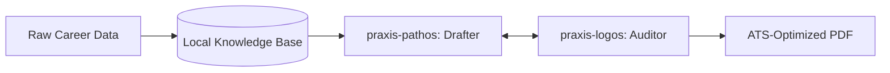

<div align="center">
  
</div>

# Praxis: AI-Powered Resume Builder & Multi-Agent Career Knowledge Base
**Defeating ATS bots, hallucination, and the blank-page problem through rigorous AI orchestration.**

---

## 🧠 The Blank Page Problem is Dead.

Using a single-shot prompt to ask an LLM to "write my resume" results in three catastrophic failures:
1. **Summarization Loss:** LLMs inherently compress facts, stripping away the exact metrics, technologies, and scale that actually get you hired.
2. **Sycophancy & Hallucination:** AI invents "synergistic paradigms" and hallucinates responsibilities to make you sound good, causing you to fail rigorous technical interviews.
3. **Context Collapse:** When recruiters call back a month later, you have no idea what resume you sent them or what the job description even was.

**Praxis** is a localized, multi-agent pipeline designed to solve these failures. It doesn't just write a resume; it builds a permanent Career Knowledge Base and deploys adversarial AI agents to meticulously tailor your history to specific roles, prep you for interviews, and organize everything perfectly.

---

## ✨ Core Capabilities

### 1. 🗄️ Permanent, Lossless Career Knowledge Base
Instead of summarizing your history into Markdown, Praxis iteratively ingests raw data (PDFs, GitHub exports, LinkedIn CSVs) into a strict, loss-proof relational database (`.praxis/data/knowledge_base.json`). It maps every tool, skill, and metric to the exact project where it was used, ensuring you never lose the hard numbers that prove your impact.

### 2. ⚖️ Adversarial AI Agents (Pathos & Logos)
When tailoring an ATS-friendly resume for a specific job description, Praxis employs a rigorous two-agent adversarial loop:
- **`praxis-pathos` (The Visionary & Coach):** Drafts the resume using your saved Voice Profile and the STAR method, focusing on compelling narrative and impact.
- **`praxis-logos` (The Truth-Teller):** Acts as a brutal auditor, rejecting any bullet point that hallucinates facts or uses AI-speak not explicitly backed by your Knowledge Base. They iterate until a mathematically honest, perfectly targeted document is produced.

### 3. 🎯 Hyper-Targeted Markdown to PDF Resumes
Simply provide a job description URL (`/praxis <job-url>`), and Praxis will run a Skill Gap Analysis. It strategically selects the most relevant facts from your history (rather than dumping your whole resume) to generate a highly targeted, ATS-optimized PDF designed specifically to beat the bots for that exact role.

### 4. 🎤 Automated Interview Prep Sheets
Beyond just getting the interview, Praxis helps you pass it. For every targeted resume generated, Praxis builds a comprehensive **Interview Guideline & Prep Sheet**. This document explicitly maps your past experience and metrics directly to the requirements in the job description, serving as a rapid orientation brief to remind you exactly how you align with the role when the recruiter calls months later.

### 5. 📂 Context-Preserving Organization
*"Which version of my resume did I send to AcmeCorp again?"* 
Praxis automatically organizes your generated resumes, tailored cover letters, and Interview Prep Sheets into dedicated company folders (e.g., `assets/AcmeCorp/`). When a recruiter calls you back a month later, you can instantly pull up the folder to see exactly what the job description was, what resume you sent, and the mapped talking points.

---

## 🏗️ Architecture & Commands

Praxis installs directly into your local AI CLI environment (e.g., `opencode`, `Claude Code`, `GitHub Copilot`) as a skill.

### The Intake Engine: `/praxis`
Runs a deterministic Deep Harvest extraction across your root directory for raw exports, parsing data into fact pools and pushing it into your Knowledge Base. It then drafts baseline profiles utilizing a "Discrete Chronological Strategy."

### The Knowledge Updater: `/praxis <text>`
Quickly appends specific accomplishments, metrics, or corrections using natural language without requiring a full CV re-upload (e.g., `/praxis at ACME co., I managed a team of 50`).

### The Baseline Generator: `/praxis resume`
Explicitly regenerates your general baseline resume (`assets/Resume.md`) directly from your knowledge base data.

### The Forge: `/praxis <job-url>`
Executes the Skill Gap Analysis and the Pathos/Logos adversarial loop. Generates the targeted PDF, the Interview Prep Sheet, and organizes them perfectly into the target company's folder.



---

## 🚀 Installation

```bash
# Clone the repository
git clone git@github.com:ksmeltzer/Praxis.git
cd Praxis
```

To install Praxis, follow your specific AI Agent Harness (e.g., `opencode`, `Claude Code`, or `GitHub Copilot`) tool's guide for installing local agents, skills, and custom commands from a project directory.

## 🔒 Privacy & Security

Praxis is designed with absolute privacy in mind. Your raw data, API keys, and generated JSON databases are intentionally `.gitignore`'d. Your career data never leaves your local machine unless you explicitly configure an external model API.